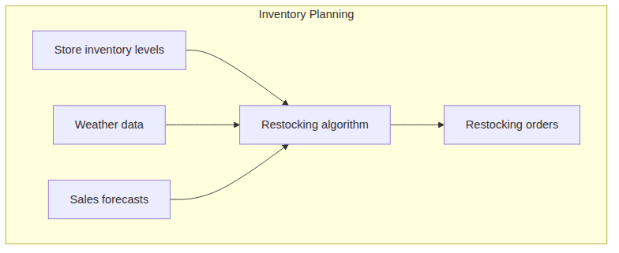
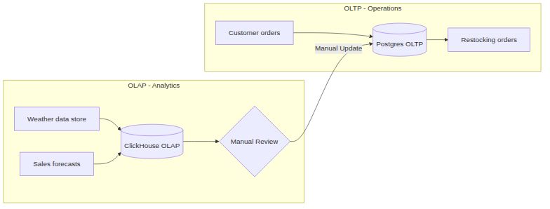
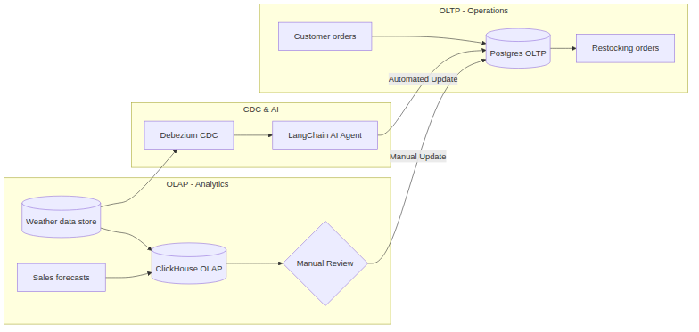

#+TITLE: Improving responses to weather changes using CDC
#+OPTIONS: toc:nil num:nil author:nil date:nil

* Introduction

Change Data Capture (CDC) is a database mechanism that detects
operational data changes in real time. In this article, we show how
CDC can be used to capture changes in the external environment and
enable swift operational decisions. We apply this
idea to a supply chain responding to changing weather conditions and
demonstrate the potential gains from using a CDC-based system.

* Use Case: Supply Chain Response

Let us assume that an enterprise is responsible for stocking stores with
sandbags in advance of a storm. It uses an existing algorithm to determine
which stores receive how many sandbags based on input parameters.

#+BEGIN_SRC mermaid :file stocking_algorithm.png :exports results
graph LR
    subgraph Planning_Process [Inventory Planning]
    direction LR
    A[Store inventory levels] --> B[Restocking algorithm]
    D[Weather data] --> B
    C[Sales forecasts] --> B
    B --> E[Restocking orders]
    end
#+END_SRC

#+RESULTS:

Customer orders at local stores are entered into an Online Transaction
Processing (OLTP) database. This determines the store inventory levels
depicted in the figure above.

Sales forecasts are based on historical sales data and weather forecasts.
A business analytics team typically runs algorithms to estimate these
sales forecasts. They work off an Online Analytical Processing (OLAP)
database.

The databases are maintained independently. The operations-oriented OLTP
database must be highly available and fast. The analytics-oriented OLAP
database supports complex queries and large datasets.

Data is synchronized between the two database systems periodically.

A sample implementation of this system using prevalent open-source
technologies is depicted below.

#+BEGIN_SRC mermaid :file status_quo_architecture.png :exports results
graph LR
    subgraph Operational_Environment [OLTP - Operations]
    A[Customer orders] --> B[(Postgres OLTP)]
    B --> C[Restocking orders]
    end

    subgraph Analytical_Environment [OLAP - Analytics]
    D[Weather data store] --> E[(ClickHouse OLAP)]
    G[Sales forecasts] --> E
    E --> F{Manual Review}
    end

    F -- "Manual Update" --> B
#+END_SRC

#+RESULTS:

* Inefficiency In The System

The "Manual Update" step suffers from latency. An analytics team must
trigger it manually. For example, a storm can change its trajectory hourly.
As the trajectory changes, the stocking needs of local stores also change.
A system with humans in the loop cannot effectively track such rapid changes.

Using CDC and generative AI technology, we can improve this system.

The analogy of a nervous system is useful to understand this shift. In
the status quo, the enterprise has the eyes (OLAP) to see the storm and
the hands to move the inventory (OLTP), but no fast link between
them.

CDC acts as the neural pathway, providing the reflexive speed
required to survive a volatile environment. By streaming the "pulses"
of weather changes directly to the "brain" (the AI Agent), we ensure
that the enterprise responds efficiently to rapid changes in the
environment.

* The CDC Increment

In the new system, incoming weather data acts as an event
producer. When the weather data updates, the system captures that
change quickly and streams it to an execution layer.

We add an automation step to the manual update. A Debezium CDC engine
monitors the operational weather data store. It detects new storm
trajectories and pushes these updates to a LangChain AI decision agent. This
agent recalculates the sandbag requirements and updates the Postgres OLTP
system in real time.

#+BEGIN_SRC mermaid :file target_architecture.png :exports results
graph LR
    subgraph Operational_Environment [OLTP - Operations]
    A[Customer orders] --> B[(Postgres OLTP)]
    B --> C[Restocking orders]
    end

    subgraph Analytical_Environment [OLAP - Analytics]
    D[(Weather data store)] --> E[(ClickHouse OLAP)]
    G[Sales forecasts] --> E
    E --> F{Manual Review}
    end

    subgraph Automation_Layer [CDC & AI]
    H[Debezium CDC]
    I[LangChain AI Agent]
    end

    D --> H
    H --> I
    I -- "Automated Update" --> B
    F -- "Manual Update" --> B
#+END_SRC

#+RESULTS:

* Safety and Guardrails

Moving from human review to AI automation requires strict guardrails.
We must ensure the system responds to environmental changes without causing
erratic swings in inventory.

The AI agent does not replace the entire stocking plan at once. Instead, it
calculates "delta" changes. If a storm shifts north, the agent increases
stock by small increments in the new path while gradually tapering off
stock in the old path. This prevents sudden, massive logistics shifts
that could overwhelm warehouses.

We implement hard bounds on the agent's authority. For example, the agent
cannot increase a store's order by more than 20% in a single hour without
human intervention.

Every automated update is logged as a specific event in the transaction
history. Because we use CDC, we can maintain an audit trail of why
a specific order was changed.
