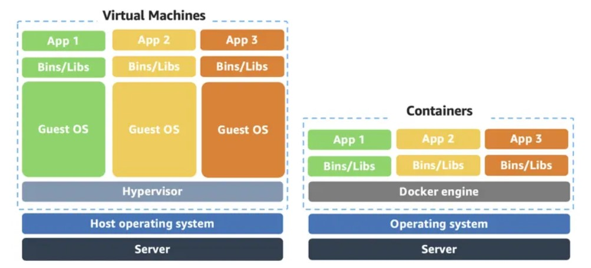

#+TITLE: Containers
#+FILETAGS: :Software:
#+STARTUP: content, inlineimages

* Containers                                                         :Review:
:PROPERTIES:
:ID:       ba0757bb-3fc9-462e-af71-336b3e3c1ad3
:END:

A container is a standardized unit that packages your code and
all its dependencies. Docker is a well-known container run-time
that simplifies the management of the entire stack needed for
container isolation.

Compared to VMs, containers don't have their own OS, so they can
start up very quickly.

See [[id:d0283e19-ef8f-471e-ad80-69b0d770a598][Kubernetes for orchestration of containers.]]

** Services

A container is a run-time unit. On the other hand, a service is a
logical grouping of containers to provide some application-level
functionality e.g. a web front-end service.
